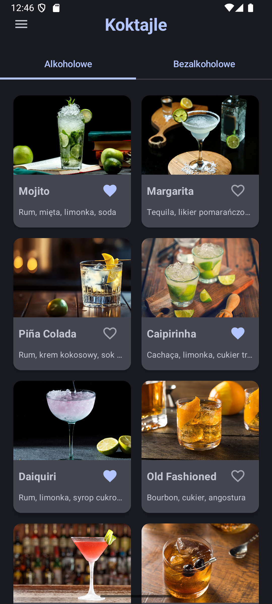
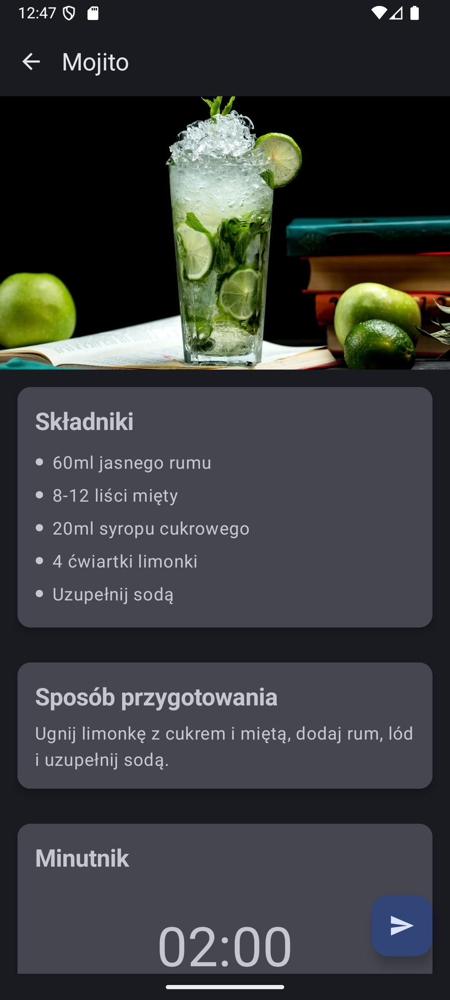
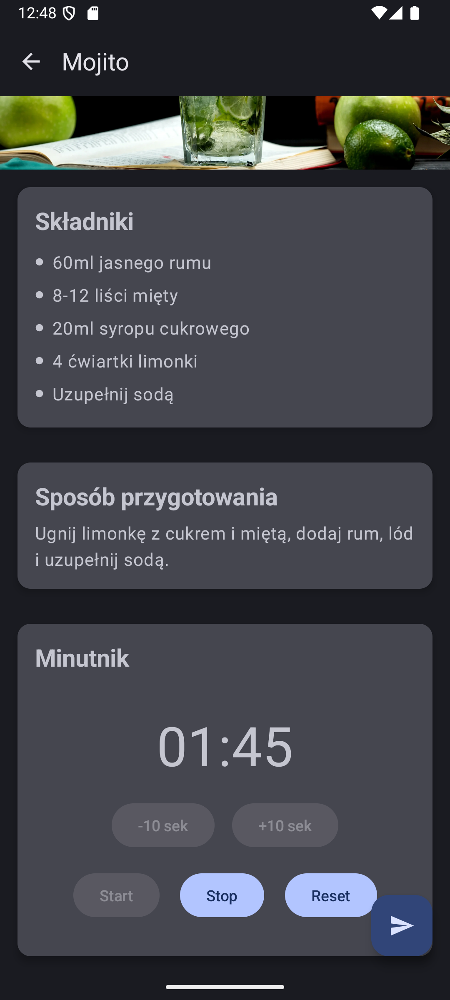

# CocktailApp

Aplikacja mobilna na Androida do przeglądania koktajli. Projekt został wykonany na zajęcia laboratoryjne z przedmiotu Aplikacje Mobilne podczas 6 semestru.

## Spis treści

- [Opis](#opis)
- [Funkcjonalności](#funkcjonalności)
- [Technologie](#technologie)
- [Zrzuty ekranu](#zrzuty-ekranu)

## Opis

CocktailApp pozwala na przeglądanie przepisów na koktajle alkoholowe i bezalkoholowe, dodawanie ich do ulubionych oraz korzystanie z minutnika podczas przygotowania napoju. Aplikacja jest responsywna na zmioane orientacji ekranu oraz dostowona do tabelta.

## Funkcjonalności

- Przeglądanie koktajli alkoholowych i bezalkoholowych
- Szczegółowe przepisy i składniki
- Dodawanie koktajli do ulubionych
- Motyw ciemny/jasny (dark mode)
- Minutnik do przygotowania koktajlu
- Ekran powitalny (splash screen)
- Wysyłanie przepisu SMS-em (symulacja)

## Technologie

- Kotlin
- Jetpack Compose (UI)
- Material 3
- Android DataStore

## Zrzuty ekranu

